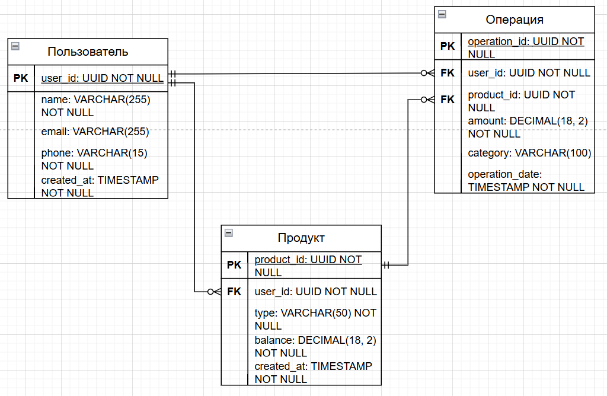

# Модель данных

:::note
Здесь тоже использовал те ERD, что есть.
:::

## Пользователь

| Атрибут    | Описание          | Тип данных   | Ключ           |
| :--------- | :---------------- | :----------- | :------------- |
| user_id    | Уникальный ID     | UUID         | Первичный ключ |
| name       | Имя пользователя  | VARCHAR(255) | -              |
| email      | Электронная почта | VARCHAR(255) | -              |
| phone      | Телефон           | VARCHAR(15)  | -              |
| created_at | Дата регистрации  | TIMESTAMP    |                |

## Продукт

| Атрибут        | Описание               | Тип данных     | Ключ           |
| :------------- | :--------------------- | :------------- | :------------- |
| operation_id   | Уникальный ID операции | UUID           | Первичный ключ |
| user_id        | ID пользователя        | UUID           | Внешний ключ   |
| product_id     | ID продукта            | UUID           | Внешний ключ   |
| amount         | Сумма операции         | DECIMAL(18, 2) | -              |
| category       | Категория операции     | VARCHAR(100)   | -              |
| operation_date | Дата операции          | TIMESTAMP      | -              |

## Операция

| Атрибут    | Описание                          | Тип данных  | Ключ            |
| :--------- | :-------------------------------- | :---------- | :-------------- |
| product_id | Уникальный ID продукта            | UUID        | Первичный ключ  |
| user_id    | Владелец продукта                 | UUID        | Внешний ключ    |
| type       | Тип продукта ("Карта", "Кошелёк") | VARCHAR(50) | -               |
| balance    | Баланс                            | "           | DECIMAL(18, 2)" |	-
| created_at | Дата создания продукта            | TIMESTAMP   | -               |
