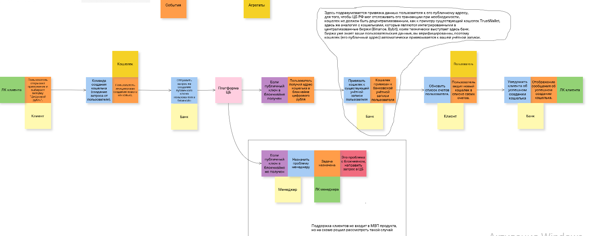
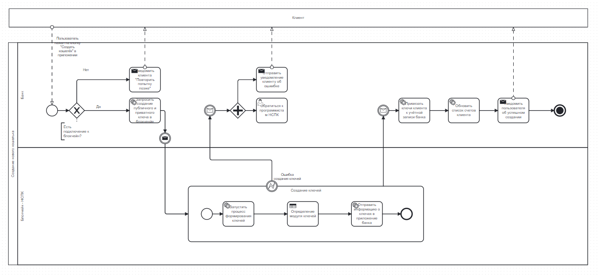
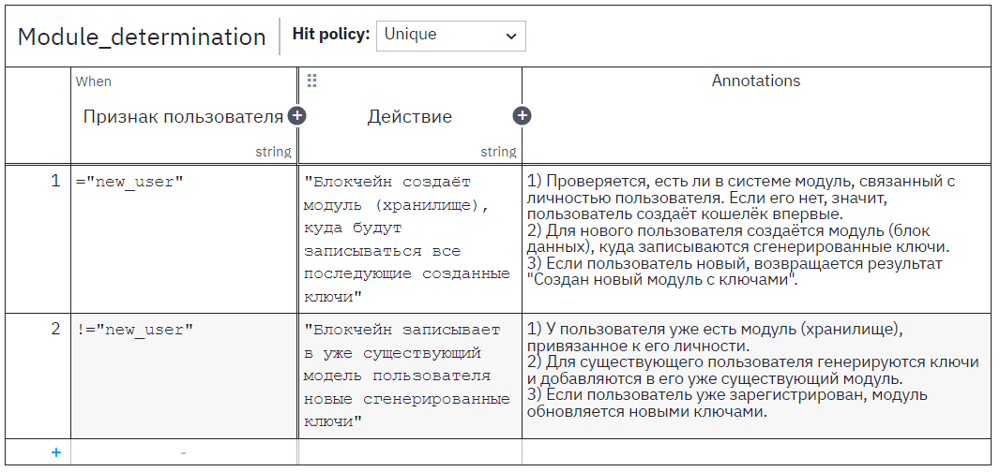

## Процесс создания кошелька для цифрового рубля

## Event Storming:

[https://unidraw.io/app/board/469efba26776204895dd](https://unidraw.io/app/board/469efba26776204895dd)



## BPMN:

Учёл комментарии прошлой версии: выделил платформу НСПК как подпроцесс, завершил процесс для клиента, указал действием с отправкой сообщения - сообщение клиенту, схему перестроил. DMN поменял в целом.



```Plain Text
<?xml version="1.0" encoding="UTF-8"?>
<bpmn:definitions xmlns:bpmn="http://www.omg.org/spec/BPMN/20100524/MODEL" xmlns:bpmndi="http://www.omg.org/spec/BPMN/20100524/DI" xmlns:dc="http://www.omg.org/spec/DD/20100524/DC" xmlns:zeebe="http://camunda.org/schema/zeebe/1.0" xmlns:di="http://www.omg.org/spec/DD/20100524/DI" xmlns:modeler="http://camunda.org/schema/modeler/1.0" id="Definitions_1tgw74m" targetNamespace="http://bpmn.io/schema/bpmn" exporter="Camunda Modeler" exporterVersion="5.28.0" modeler:executionPlatform="Camunda Cloud" modeler:executionPlatformVersion="8.6.0">
  <bpmn:collaboration id="Collaboration_18vdly8">
    <bpmn:participant id="Participant_1haw1qo" name="Создание нового кошелька" processRef="Process_0vtb0e7" />
    <bpmn:participant id="Participant_0smscb6" name="Клиент" />
    <bpmn:messageFlow id="Flow_0ojkmso" name="Пользователь нажал на кнопку &#34;Создать кошелёк&#34; в приложении" sourceRef="Participant_0smscb6" targetRef="Event_0xag2dj" />
    <bpmn:messageFlow id="Flow_1mj0ljl" sourceRef="Activity_1v5dsxd" targetRef="Participant_0smscb6" />
    <bpmn:messageFlow id="Flow_161f7zn" sourceRef="Activity_0bo1vh1" targetRef="Participant_0smscb6" />
    <bpmn:messageFlow id="Flow_0b05bqf" sourceRef="Activity_1c63nrz" targetRef="Participant_0smscb6" />
    <bpmn:textAnnotation id="TextAnnotation_1j6krdr">
      <bpmn:text>Есть подключение к блокчейн?</bpmn:text>
    </bpmn:textAnnotation>
    <bpmn:association id="Association_0x0lngw" associationDirection="None" sourceRef="Gateway_0rsx0ca" targetRef="TextAnnotation_1j6krdr" />
  </bpmn:collaboration>
  <bpmn:process id="Process_0vtb0e7" isExecutable="true">
    <bpmn:laneSet id="LaneSet_0uin3np">
      <bpmn:lane id="Lane_1sw60yj" name="Банк">
        <bpmn:flowNodeRef>Event_0xag2dj</bpmn:flowNodeRef>
        <bpmn:flowNodeRef>Activity_0xclru3</bpmn:flowNodeRef>
        <bpmn:flowNodeRef>Gateway_0rsx0ca</bpmn:flowNodeRef>
        <bpmn:flowNodeRef>Event_0fnqg4d</bpmn:flowNodeRef>
        <bpmn:flowNodeRef>Gateway_046ec70</bpmn:flowNodeRef>
        <bpmn:flowNodeRef>Activity_0kcqv8y</bpmn:flowNodeRef>
        <bpmn:flowNodeRef>Activity_1c63nrz</bpmn:flowNodeRef>
        <bpmn:flowNodeRef>Activity_1v5dsxd</bpmn:flowNodeRef>
        <bpmn:flowNodeRef>Event_1qxv771</bpmn:flowNodeRef>
        <bpmn:flowNodeRef>Event_088qfbr</bpmn:flowNodeRef>
        <bpmn:flowNodeRef>Activity_06cradf</bpmn:flowNodeRef>
        <bpmn:flowNodeRef>Activity_14gqi8f</bpmn:flowNodeRef>
        <bpmn:flowNodeRef>Event_18pw8zn</bpmn:flowNodeRef>
        <bpmn:flowNodeRef>Activity_0bo1vh1</bpmn:flowNodeRef>
      </bpmn:lane>
      <bpmn:lane id="Lane_0t2rmrj" name="Блокчейн - НСПК">
        <bpmn:flowNodeRef>Activity_1fu3xoz</bpmn:flowNodeRef>
        <bpmn:flowNodeRef>Event_1om6mgl</bpmn:flowNodeRef>
      </bpmn:lane>
    </bpmn:laneSet>
    <bpmn:startEvent id="Event_0xag2dj">
      <bpmn:outgoing>Flow_1jq0lsh</bpmn:outgoing>
    </bpmn:startEvent>
    <bpmn:serviceTask id="Activity_0xclru3" name="Запросить создание публичного и приватного ключа в блокченйе">
      <bpmn:incoming>Flow_09e9nuj</bpmn:incoming>
      <bpmn:outgoing>Flow_1ypi81g</bpmn:outgoing>
    </bpmn:serviceTask>
    <bpmn:exclusiveGateway id="Gateway_0rsx0ca">
      <bpmn:incoming>Flow_1jq0lsh</bpmn:incoming>
      <bpmn:outgoing>Flow_09e9nuj</bpmn:outgoing>
      <bpmn:outgoing>Flow_0iahehr</bpmn:outgoing>
    </bpmn:exclusiveGateway>
    <bpmn:intermediateCatchEvent id="Event_0fnqg4d">
      <bpmn:incoming>Flow_1ly8fjo</bpmn:incoming>
      <bpmn:outgoing>Flow_05h03d0</bpmn:outgoing>
      <bpmn:messageEventDefinition id="MessageEventDefinition_1tqwykd" />
    </bpmn:intermediateCatchEvent>
    <bpmn:parallelGateway id="Gateway_046ec70">
      <bpmn:incoming>Flow_05h03d0</bpmn:incoming>
      <bpmn:outgoing>Flow_11xswzi</bpmn:outgoing>
      <bpmn:outgoing>Flow_12qvn8q</bpmn:outgoing>
    </bpmn:parallelGateway>
    <bpmn:userTask id="Activity_0kcqv8y" name="Обратиться к программистам НСПК">
      <bpmn:incoming>Flow_11xswzi</bpmn:incoming>
    </bpmn:userTask>
    <bpmn:sendTask id="Activity_1c63nrz" name="Уведомить клиента &#34;Повторить попытку позже&#34;">
      <bpmn:incoming>Flow_0iahehr</bpmn:incoming>
    </bpmn:sendTask>
    <bpmn:sendTask id="Activity_1v5dsxd" name="Отправить уведомление клиенту об ошиибке">
      <bpmn:incoming>Flow_12qvn8q</bpmn:incoming>
    </bpmn:sendTask>
    <bpmn:intermediateThrowEvent id="Event_1qxv771">
      <bpmn:incoming>Flow_1ypi81g</bpmn:incoming>
      <bpmn:outgoing>Flow_1fjoiai</bpmn:outgoing>
      <bpmn:messageEventDefinition id="MessageEventDefinition_0do21bw" />
    </bpmn:intermediateThrowEvent>
    <bpmn:intermediateCatchEvent id="Event_088qfbr">
      <bpmn:incoming>Flow_0qxpkgv</bpmn:incoming>
      <bpmn:outgoing>Flow_12aph30</bpmn:outgoing>
      <bpmn:messageEventDefinition id="MessageEventDefinition_1vg6cdi" />
    </bpmn:intermediateCatchEvent>
    <bpmn:serviceTask id="Activity_06cradf" name="Привязать ключи клиента к учётной записи банка">
      <bpmn:incoming>Flow_12aph30</bpmn:incoming>
      <bpmn:outgoing>Flow_1k4ua4e</bpmn:outgoing>
    </bpmn:serviceTask>
    <bpmn:serviceTask id="Activity_14gqi8f" name="Обновить список счетов клиента">
      <bpmn:incoming>Flow_1k4ua4e</bpmn:incoming>
      <bpmn:outgoing>Flow_06g7s9q</bpmn:outgoing>
    </bpmn:serviceTask>
    <bpmn:endEvent id="Event_18pw8zn">
      <bpmn:incoming>Flow_1bzo9ay</bpmn:incoming>
      <bpmn:terminateEventDefinition id="TerminateEventDefinition_154z16l" />
    </bpmn:endEvent>
    <bpmn:sendTask id="Activity_0bo1vh1" name="Уведомить пользователя об успешном создании">
      <bpmn:incoming>Flow_06g7s9q</bpmn:incoming>
      <bpmn:outgoing>Flow_1bzo9ay</bpmn:outgoing>
    </bpmn:sendTask>
    <bpmn:subProcess id="Activity_1fu3xoz" name="Создание ключей">
      <bpmn:incoming>Flow_1fjoiai</bpmn:incoming>
      <bpmn:outgoing>Flow_0qxpkgv</bpmn:outgoing>
      <bpmn:serviceTask id="Activity_0amcef8" name="Запустить процесс формирования ключей">
        <bpmn:incoming>Flow_0dnbtqx</bpmn:incoming>
        <bpmn:outgoing>Flow_0krfhk8</bpmn:outgoing>
      </bpmn:serviceTask>
      <bpmn:serviceTask id="Activity_1frf8i0" name="Отправить информацию о ключах в приложение банка">
        <bpmn:incoming>Flow_0df106v</bpmn:incoming>
        <bpmn:outgoing>Flow_03x04r8</bpmn:outgoing>
      </bpmn:serviceTask>
      <bpmn:startEvent id="Event_0wn8hlr">
        <bpmn:outgoing>Flow_0dnbtqx</bpmn:outgoing>
      </bpmn:startEvent>
      <bpmn:endEvent id="Event_0gwerd7">
        <bpmn:incoming>Flow_03x04r8</bpmn:incoming>
      </bpmn:endEvent>
      <bpmn:businessRuleTask id="Activity_01uvy8e" name="Определение модуля ключей">
        <bpmn:extensionElements>
          <zeebe:calledDecision decisionId="Module_determination" />
        </bpmn:extensionElements>
        <bpmn:incoming>Flow_0krfhk8</bpmn:incoming>
        <bpmn:outgoing>Flow_0df106v</bpmn:outgoing>
      </bpmn:businessRuleTask>
      <bpmn:sequenceFlow id="Flow_0dnbtqx" sourceRef="Event_0wn8hlr" targetRef="Activity_0amcef8" />
      <bpmn:sequenceFlow id="Flow_0krfhk8" sourceRef="Activity_0amcef8" targetRef="Activity_01uvy8e" />
      <bpmn:sequenceFlow id="Flow_0df106v" sourceRef="Activity_01uvy8e" targetRef="Activity_1frf8i0" />
      <bpmn:sequenceFlow id="Flow_03x04r8" sourceRef="Activity_1frf8i0" targetRef="Event_0gwerd7" />
    </bpmn:subProcess>
    <bpmn:boundaryEvent id="Event_1om6mgl" name="Ошибка создания ключей" attachedToRef="Activity_1fu3xoz">
      <bpmn:outgoing>Flow_1ly8fjo</bpmn:outgoing>
      <bpmn:errorEventDefinition id="ErrorEventDefinition_1k2npkw" />
    </bpmn:boundaryEvent>
    <bpmn:sequenceFlow id="Flow_1jq0lsh" sourceRef="Event_0xag2dj" targetRef="Gateway_0rsx0ca" />
    <bpmn:sequenceFlow id="Flow_09e9nuj" name="Да" sourceRef="Gateway_0rsx0ca" targetRef="Activity_0xclru3" />
    <bpmn:sequenceFlow id="Flow_0iahehr" name="Нет" sourceRef="Gateway_0rsx0ca" targetRef="Activity_1c63nrz" />
    <bpmn:sequenceFlow id="Flow_1ly8fjo" sourceRef="Event_1om6mgl" targetRef="Event_0fnqg4d" />
    <bpmn:sequenceFlow id="Flow_05h03d0" sourceRef="Event_0fnqg4d" targetRef="Gateway_046ec70" />
    <bpmn:sequenceFlow id="Flow_11xswzi" sourceRef="Gateway_046ec70" targetRef="Activity_0kcqv8y" />
    <bpmn:sequenceFlow id="Flow_12qvn8q" sourceRef="Gateway_046ec70" targetRef="Activity_1v5dsxd" />
    <bpmn:sequenceFlow id="Flow_1fjoiai" sourceRef="Event_1qxv771" targetRef="Activity_1fu3xoz" />
    <bpmn:sequenceFlow id="Flow_0qxpkgv" sourceRef="Activity_1fu3xoz" targetRef="Event_088qfbr" />
    <bpmn:sequenceFlow id="Flow_12aph30" sourceRef="Event_088qfbr" targetRef="Activity_06cradf" />
    <bpmn:sequenceFlow id="Flow_1k4ua4e" sourceRef="Activity_06cradf" targetRef="Activity_14gqi8f" />
    <bpmn:sequenceFlow id="Flow_06g7s9q" sourceRef="Activity_14gqi8f" targetRef="Activity_0bo1vh1" />
    <bpmn:sequenceFlow id="Flow_1bzo9ay" sourceRef="Activity_0bo1vh1" targetRef="Event_18pw8zn" />
    <bpmn:sequenceFlow id="Flow_1ypi81g" sourceRef="Activity_0xclru3" targetRef="Event_1qxv771" />
  </bpmn:process>
  <bpmndi:BPMNDiagram id="BPMNDiagram_1">
    <bpmndi:BPMNPlane id="BPMNPlane_1" bpmnElement="Collaboration_18vdly8">
      <bpmndi:BPMNShape id="BPMNShape_1cpleyx" bpmnElement="Participant_1haw1qo" isHorizontal="true">
        <dc:Bounds x="130" y="190" width="1871" height="720" />
        <bpmndi:BPMNLabel />
      </bpmndi:BPMNShape>
      <bpmndi:BPMNShape id="BPMNShape_0q78bqr" bpmnElement="Lane_1sw60yj" isHorizontal="true">
        <dc:Bounds x="160" y="190" width="1841" height="340" />
        <bpmndi:BPMNLabel />
      </bpmndi:BPMNShape>
      <bpmndi:BPMNShape id="BPMNShape_12bnump" bpmnElement="Lane_0t2rmrj" isHorizontal="true">
        <dc:Bounds x="160" y="530" width="1841" height="380" />
        <bpmndi:BPMNLabel />
      </bpmndi:BPMNShape>
      <bpmndi:BPMNShape id="BPMNShape_08tbf32" bpmnElement="Event_0xag2dj">
        <dc:Bounds x="253" y="392" width="36" height="36" />
      </bpmndi:BPMNShape>
      <bpmndi:BPMNShape id="BPMNShape_13now5j" bpmnElement="Activity_0xclru3">
        <dc:Bounds x="521" y="370" width="100" height="80" />
        <bpmndi:BPMNLabel />
      </bpmndi:BPMNShape>
      <bpmndi:BPMNShape id="BPMNShape_1freq91" bpmnElement="Gateway_0rsx0ca" isMarkerVisible="true">
        <dc:Bounds x="326" y="385" width="50" height="50" />
      </bpmndi:BPMNShape>
      <bpmndi:BPMNShape id="BPMNShape_189w3p9" bpmnElement="Event_0fnqg4d">
        <dc:Bounds x="763" y="392" width="36" height="36" />
      </bpmndi:BPMNShape>
      <bpmndi:BPMNShape id="BPMNShape_0367ch9" bpmnElement="Gateway_046ec70">
        <dc:Bounds x="846" y="385" width="50" height="50" />
      </bpmndi:BPMNShape>
      <bpmndi:BPMNShape id="BPMNShape_1eav6tg" bpmnElement="Activity_0kcqv8y">
        <dc:Bounds x="931" y="370" width="100" height="80" />
        <bpmndi:BPMNLabel />
      </bpmndi:BPMNShape>
      <bpmndi:BPMNShape id="BPMNShape_08wiv24" bpmnElement="Activity_1c63nrz">
        <dc:Bounds x="521" y="270" width="100" height="80" />
        <bpmndi:BPMNLabel />
      </bpmndi:BPMNShape>
      <bpmndi:BPMNShape id="BPMNShape_07hmy75" bpmnElement="Activity_1v5dsxd">
        <dc:Bounds x="931" y="270" width="100" height="80" />
        <bpmndi:BPMNLabel />
      </bpmndi:BPMNShape>
      <bpmndi:BPMNShape id="BPMNShape_0jyj7lz" bpmnElement="Event_1qxv771">
        <dc:Bounds x="618" y="482" width="36" height="36" />
      </bpmndi:BPMNShape>
      <bpmndi:BPMNShape id="BPMNShape_1vgi54x" bpmnElement="Event_088qfbr">
        <dc:Bounds x="1323" y="392" width="36" height="36" />
      </bpmndi:BPMNShape>
      <bpmndi:BPMNShape id="BPMNShape_01m7r8f" bpmnElement="Activity_06cradf">
        <dc:Bounds x="1391" y="370" width="100" height="80" />
        <bpmndi:BPMNLabel />
      </bpmndi:BPMNShape>
      <bpmndi:BPMNShape id="BPMNShape_00h0wxt" bpmnElement="Activity_14gqi8f">
        <dc:Bounds x="1551" y="370" width="100" height="80" />
        <bpmndi:BPMNLabel />
      </bpmndi:BPMNShape>
      <bpmndi:BPMNShape id="BPMNShape_0zan43z" bpmnElement="Event_18pw8zn">
        <dc:Bounds x="1893" y="392" width="36" height="36" />
      </bpmndi:BPMNShape>
      <bpmndi:BPMNShape id="BPMNShape_1fecqac" bpmnElement="Activity_0bo1vh1">
        <dc:Bounds x="1711" y="370" width="100" height="80" />
        <bpmndi:BPMNLabel />
      </bpmndi:BPMNShape>
      <bpmndi:BPMNShape id="BPMNShape_0gyp51t" bpmnElement="Activity_1fu3xoz" isExpanded="true">
        <dc:Bounds x="711" y="655" width="760" height="180" />
        <bpmndi:BPMNLabel />
      </bpmndi:BPMNShape>
      <bpmndi:BPMNShape id="BPMNShape_1r0clnq" bpmnElement="Activity_0amcef8">
        <dc:Bounds x="823" y="705" width="100" height="80" />
        <bpmndi:BPMNLabel />
      </bpmndi:BPMNShape>
      <bpmndi:BPMNShape id="BPMNShape_10l4se6" bpmnElement="Activity_1frf8i0">
        <dc:Bounds x="1238" y="705" width="100" height="80" />
        <bpmndi:BPMNLabel />
      </bpmndi:BPMNShape>
      <bpmndi:BPMNShape id="BPMNShape_1mb3mw4" bpmnElement="Event_0wn8hlr">
        <dc:Bounds x="753" y="727" width="36" height="36" />
      </bpmndi:BPMNShape>
      <bpmndi:BPMNShape id="Event_0gwerd7_di" bpmnElement="Event_0gwerd7">
        <dc:Bounds x="1398" y="727" width="36" height="36" />
      </bpmndi:BPMNShape>
      <bpmndi:BPMNShape id="Activity_01uvy8e_di" bpmnElement="Activity_01uvy8e">
        <dc:Bounds x="1031" y="705" width="100" height="80" />
        <bpmndi:BPMNLabel />
      </bpmndi:BPMNShape>
      <bpmndi:BPMNEdge id="Flow_0dnbtqx_di" bpmnElement="Flow_0dnbtqx">
        <di:waypoint x="789" y="745" />
        <di:waypoint x="823" y="745" />
      </bpmndi:BPMNEdge>
      <bpmndi:BPMNEdge id="BPMNEdge_1lwe88h" bpmnElement="Flow_0krfhk8">
        <di:waypoint x="923" y="745" />
        <di:waypoint x="1031" y="745" />
      </bpmndi:BPMNEdge>
      <bpmndi:BPMNEdge id="Flow_0df106v_di" bpmnElement="Flow_0df106v">
        <di:waypoint x="1131" y="745" />
        <di:waypoint x="1238" y="745" />
      </bpmndi:BPMNEdge>
      <bpmndi:BPMNEdge id="Flow_03x04r8_di" bpmnElement="Flow_03x04r8">
        <di:waypoint x="1338" y="745" />
        <di:waypoint x="1398" y="745" />
      </bpmndi:BPMNEdge>
      <bpmndi:BPMNShape id="Event_1om6mgl_di" bpmnElement="Event_1om6mgl">
        <dc:Bounds x="963" y="637" width="36" height="36" />
        <bpmndi:BPMNLabel>
          <dc:Bounds x="987" y="611" width="88" height="27" />
        </bpmndi:BPMNLabel>
      </bpmndi:BPMNShape>
      <bpmndi:BPMNEdge id="BPMNEdge_00nvimq" bpmnElement="Flow_1jq0lsh">
        <di:waypoint x="289" y="410" />
        <di:waypoint x="326" y="410" />
      </bpmndi:BPMNEdge>
      <bpmndi:BPMNEdge id="BPMNEdge_0nek71u" bpmnElement="Flow_09e9nuj">
        <di:waypoint x="376" y="410" />
        <di:waypoint x="521" y="410" />
        <bpmndi:BPMNLabel>
          <dc:Bounds x="414" y="392" width="14" height="14" />
        </bpmndi:BPMNLabel>
      </bpmndi:BPMNEdge>
      <bpmndi:BPMNEdge id="Flow_1ypi81g_di" bpmnElement="Flow_1ypi81g">
        <di:waypoint x="621" y="410" />
        <di:waypoint x="636" y="410" />
        <di:waypoint x="636" y="482" />
      </bpmndi:BPMNEdge>
      <bpmndi:BPMNEdge id="BPMNEdge_1ujrvtf" bpmnElement="Flow_0iahehr">
        <di:waypoint x="351" y="385" />
        <di:waypoint x="351" y="310" />
        <di:waypoint x="521" y="310" />
        <bpmndi:BPMNLabel>
          <dc:Bounds x="371" y="273" width="20" height="14" />
        </bpmndi:BPMNLabel>
      </bpmndi:BPMNEdge>
      <bpmndi:BPMNEdge id="Flow_1ly8fjo_di" bpmnElement="Flow_1ly8fjo">
        <di:waypoint x="981" y="637" />
        <di:waypoint x="981" y="570" />
        <di:waypoint x="781" y="570" />
        <di:waypoint x="781" y="428" />
      </bpmndi:BPMNEdge>
      <bpmndi:BPMNEdge id="BPMNEdge_0zid9t6" bpmnElement="Flow_05h03d0">
        <di:waypoint x="799" y="410" />
        <di:waypoint x="846" y="410" />
      </bpmndi:BPMNEdge>
      <bpmndi:BPMNEdge id="BPMNEdge_11m8kzh" bpmnElement="Flow_11xswzi">
        <di:waypoint x="896" y="410" />
        <di:waypoint x="931" y="410" />
      </bpmndi:BPMNEdge>
      <bpmndi:BPMNEdge id="Flow_12qvn8q_di" bpmnElement="Flow_12qvn8q">
        <di:waypoint x="871" y="385" />
        <di:waypoint x="871" y="310" />
        <di:waypoint x="931" y="310" />
      </bpmndi:BPMNEdge>
      <bpmndi:BPMNEdge id="Flow_1fjoiai_di" bpmnElement="Flow_1fjoiai">
        <di:waypoint x="636" y="518" />
        <di:waypoint x="636" y="745" />
        <di:waypoint x="711" y="745" />
      </bpmndi:BPMNEdge>
      <bpmndi:BPMNEdge id="Flow_0qxpkgv_di" bpmnElement="Flow_0qxpkgv">
        <di:waypoint x="1341" y="655" />
        <di:waypoint x="1341" y="428" />
      </bpmndi:BPMNEdge>
      <bpmndi:BPMNEdge id="BPMNEdge_1l57xzh" bpmnElement="Flow_12aph30">
        <di:waypoint x="1359" y="410" />
        <di:waypoint x="1391" y="410" />
      </bpmndi:BPMNEdge>
      <bpmndi:BPMNEdge id="BPMNEdge_0ohpqj8" bpmnElement="Flow_1k4ua4e">
        <di:waypoint x="1491" y="410" />
        <di:waypoint x="1551" y="410" />
      </bpmndi:BPMNEdge>
      <bpmndi:BPMNEdge id="Flow_06g7s9q_di" bpmnElement="Flow_06g7s9q">
        <di:waypoint x="1651" y="410" />
        <di:waypoint x="1711" y="410" />
      </bpmndi:BPMNEdge>
      <bpmndi:BPMNEdge id="Flow_1bzo9ay_di" bpmnElement="Flow_1bzo9ay">
        <di:waypoint x="1811" y="410" />
        <di:waypoint x="1893" y="410" />
      </bpmndi:BPMNEdge>
      <bpmndi:BPMNShape id="BPMNShape_0q4eafk" bpmnElement="Participant_0smscb6" isHorizontal="true">
        <dc:Bounds x="132" y="80" width="1869" height="60" />
        <bpmndi:BPMNLabel />
      </bpmndi:BPMNShape>
      <bpmndi:BPMNEdge id="BPMNEdge_0xgn0pv" bpmnElement="Association_0x0lngw">
        <di:waypoint x="351" y="435" />
        <di:waypoint x="351" y="450" />
      </bpmndi:BPMNEdge>
      <bpmndi:BPMNShape id="BPMNShape_1k6v1r6" bpmnElement="TextAnnotation_1j6krdr">
        <dc:Bounds x="301" y="450" width="100.00000393944642" height="55.077452667814114" />
        <bpmndi:BPMNLabel />
      </bpmndi:BPMNShape>
      <bpmndi:BPMNEdge id="BPMNEdge_0wf8yip" bpmnElement="Flow_0ojkmso">
        <di:waypoint x="271" y="140" />
        <di:waypoint x="271" y="392" />
        <bpmndi:BPMNLabel>
          <dc:Bounds x="279" y="171" width="84" height="66" />
        </bpmndi:BPMNLabel>
      </bpmndi:BPMNEdge>
      <bpmndi:BPMNEdge id="Flow_0b05bqf_di" bpmnElement="Flow_0b05bqf">
        <di:waypoint x="571" y="270" />
        <di:waypoint x="571" y="140" />
      </bpmndi:BPMNEdge>
      <bpmndi:BPMNEdge id="Flow_1mj0ljl_di" bpmnElement="Flow_1mj0ljl">
        <di:waypoint x="981" y="270" />
        <di:waypoint x="981" y="140" />
      </bpmndi:BPMNEdge>
      <bpmndi:BPMNEdge id="Flow_161f7zn_di" bpmnElement="Flow_161f7zn">
        <di:waypoint x="1761" y="370" />
        <di:waypoint x="1761" y="140" />
      </bpmndi:BPMNEdge>
    </bpmndi:BPMNPlane>
  </bpmndi:BPMNDiagram>
</bpmn:definitions>

```

## DMN:

**Обоснование:** Когда система отправляет запрос блокчейну о том, что необходимо создать пару ключей, блокчейн может обработать запрос и вернуть значение, однако это блокчейн ЦБ, он не является подобием блокчейна децентрализованных криптовалют, ЦБ нужно понимать кто пользуется блокчейном, для кого создаётся связка ключей. Теперь представим ситуацию пользователь создал себе 1 кошелёк для зарплаты (1 пара ключей), а другой кошелёк для того, чтобы получать доход от его бизнеса перепродаж (уже 2 пары ключей) - просто потому, что он решил использовать разные кошельки для разных нужд. В таком случае у ЦБ появляется необходимость не сверять каждую пару ключей с разными пользователями, а сразу привязать все эти пары к одному модулю (хранилищу), ассоциированному с конретным человеком. Для этого в BPMN я решил указать DMN, которая описывает, что в зависимости от признака пользователя будет выполняться то или иное действие.



```Plain Text
<?xml version="1.0" encoding="UTF-8"?>
<definitions xmlns="https://www.omg.org/spec/DMN/20191111/MODEL/" xmlns:dmndi="https://www.omg.org/spec/DMN/20191111/DMNDI/" xmlns:dc="http://www.omg.org/spec/DMN/20180521/DC/" xmlns:modeler="http://camunda.org/schema/modeler/1.0" id="Definitions_0eydzpg" name="DRD" namespace="http://camunda.org/schema/1.0/dmn" exporter="Camunda Modeler" exporterVersion="5.28.0" modeler:executionPlatform="Camunda Cloud" modeler:executionPlatformVersion="8.6.0">
  <decision id="Decision_0qhveax" name="Module_determination">
    <decisionTable id="DecisionTable_05yo4cr">
      <input id="Input_1" label="Признак пользователя">
        <inputExpression id="InputExpression_1" typeRef="string">
          <text></text>
        </inputExpression>
      </input>
      <output id="Output_1" label="Действие" typeRef="string" />
      <rule id="DecisionRule_19vu5bm">
        <description>1) Проверяется, есть ли в системе модуль, связанный с личностью пользователя. Если его нет, значит, пользователь создаёт кошелёк впервые.                                  2) Для нового пользователя создаётся модуль (блок данных), куда записываются сгенерированные ключи.            3) Если пользователь новый, возвращается результат "Создан новый модуль с ключами".</description>
        <inputEntry id="UnaryTests_1drtlh6">
          <text>="new_user"</text>
        </inputEntry>
        <outputEntry id="LiteralExpression_0hz7mxy">
          <text>"Блокчейн создаёт модуль (хранилище), куда будут записываться все последующие созданные ключи"</text>
        </outputEntry>
      </rule>
      <rule id="DecisionRule_13dlw6e">
        <description>1) У пользователя уже есть модуль (хранилище), привязанное к его личности.                                                         2) Для существующего пользователя генерируются ключи и добавляются в его уже существующий модуль.                   3) Если пользователь уже зарегистрирован, модуль обновляется новыми ключами.</description>
        <inputEntry id="UnaryTests_0ag5atc">
          <text>!="new_user"	</text>
        </inputEntry>
        <outputEntry id="LiteralExpression_1sihw01">
          <text>"Блокчейн записывает в уже существующий модель пользователя новые сгенерированные ключи"</text>
        </outputEntry>
      </rule>
    </decisionTable>
  </decision>
  <dmndi:DMNDI>
    <dmndi:DMNDiagram>
      <dmndi:DMNShape dmnElementRef="Decision_0qhveax">
        <dc:Bounds height="80" width="180" x="160" y="100" />
      </dmndi:DMNShape>
    </dmndi:DMNDiagram>
  </dmndi:DMNDI>
</definitions>

```


