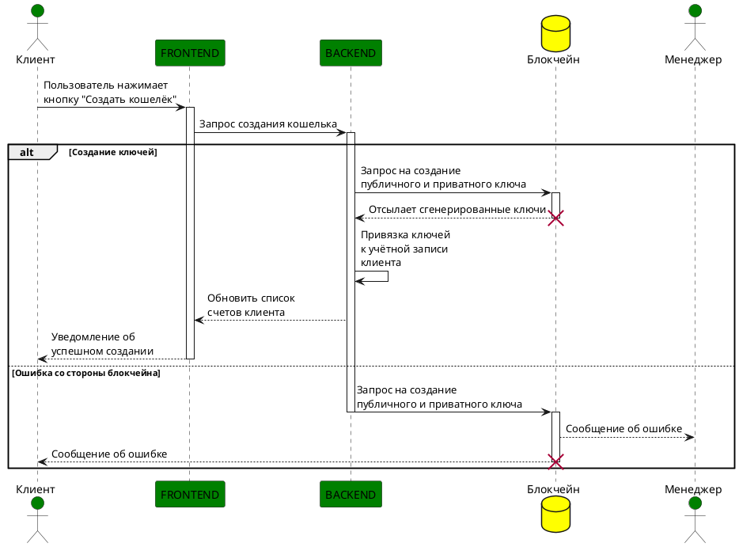

## Алгоритм создания кошелька

 1. Инициирование действия
- Клиент нажимает на кнопку **"Создать кошелёк"** в пользовательском интерфейсе.
- Запрос отправляется от **FRONTEND** к **BACKEND**.
 2. Создание ключей
- **BACKEND** отправляет запрос к системе **блокчейна** для генерации пары ключей (публичного и приватного).
- **Система блокчейна**:
  - Генерирует ключи.
  - Возвращает их **BACKEND**.
 3. Привязка ключей
- **BACKEND**:
  - Привязывает сгенерированные ключи к учётной записи клиента.
  - Обновляет данные о счетах клиента.
- **FRONTEND**:
  - Получает уведомление об успешном создании кошелька.
  - Информирует клиента о завершении операции.
 4. Обработка ошибок
- Если при создании ключей возникает ошибка на стороне **блокчейна**:
  - **BACKEND** повторно отправляет запрос к **блокчейну**.
  - **Блокчейн** уведомляет:
    - Менеджера об ошибке.
    - Клиента об ошибке.
 5. Завершение
- При успешном создании кошелька система уведомляет клиента через интерфейс.
- В случае ошибки клиент и менеджер получают соответствующее сообщение.
