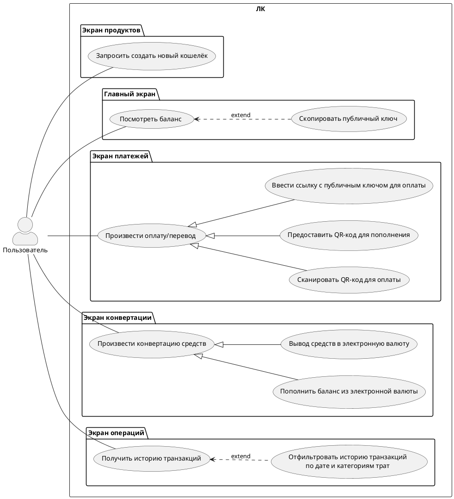

## Описание вариантов использования системы

 ### Актор
- **Пользователь**: основной актор, взаимодействующий с системой через личный кабинет.

 Пакеты и варианты использования

 1. Экран продуктов
- **Запросить создать новый кошелёк** (`uc1`): Пользователь может отправить запрос на создание нового кошелька через экран продуктов.

 2. Главный экран
- **Посмотреть баланс** (`uc2`): Пользователь может проверить текущий баланс своих кошельков.
  - **Скопировать публичный ключ** (`auc21`): Расширение варианта использования `uc2`, позволяющее скопировать публичный ключ кошелька.

 3. Экран платежей
- **Произвести оплату/перевод** (`uc3`): Пользователь может инициировать перевод средств или оплату через кошелёк.
  - **Сканировать QR-код для оплаты** (`auc31`): Пользователь сканирует QR-код, чтобы выполнить оплату.
  - **Предоставить QR-код для пополнения** (`auc32`): Пользователь генерирует QR-код, чтобы другой пользователь мог пополнить его кошелёк.
  - **Ввести ссылку с публичным ключом для оплаты** (`auc33`): Пользователь вводит ссылку с публичным ключом для перевода средств.

 4. Экран конвертации
- **Произвести конвертацию средств** (`uc4`): Пользователь может обменивать средства между разными валютами.
  - **Пополнить баланс из электронной валюты** (`auc41`): Пользователь переводит средства из электронной валюты в цифровую.
  - **Вывод средств в электронную валюту** (`auc42`): Пользователь конвертирует цифровую валюту обратно в электронную.

 5. Экран операций
- **Получить историю транзакций** (`uc5`): Пользователь может просмотреть историю транзакций.
  - **Отфильтровать историю транзакций по дате и категориям трат** (`auc51`): Расширение варианта использования `uc5`, позволяющее применять фильтры по дате и категориям расходов.

### Связи между вариантами использования
- `uc2` **расширяется** (`extend`) вариантом `auc21` для копирования публичного ключа.
- `uc3` **обобщает** варианты:
  - Сканировать QR-код для оплаты (`auc31`).
  - Предоставить QR-код для пополнения (`auc32`).
  - Ввести ссылку с публичным ключом для оплаты (`auc33`).
- `uc4` **обобщает** варианты:
  - Пополнить баланс из электронной валюты (`auc41`).
  - Вывод средств в электронную валюту (`auc42`).
- `uc5` **расширяется** (`extend`) вариантом `auc51` для фильтрации истории транзакций.
